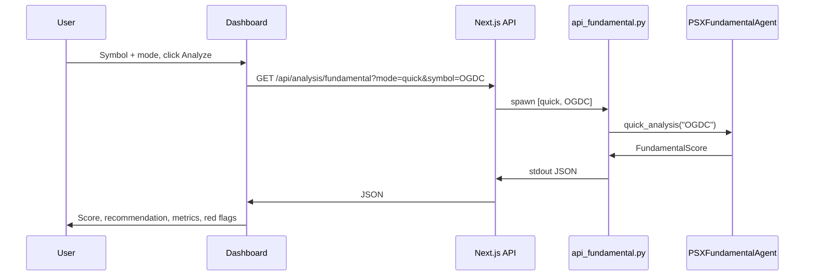

# Plan: Fundamental Agent Integration (Step by Step)

## Context

- **Existing agent**: [psx_fundamental_agent.py](psx_fundamental_agent.py) — `PSXFundamentalAgent` with `quick_analysis(symbol)`, `deep_analysis(symbol)`, `screen_universe(symbols)`. Returns `FundamentalScore` (0–100 score, BUY/HOLD/SELL, valuation/health/growth/momentum, red flags, catalysts, fair value). See [FUNDAMENTAL_AGENT_README.md](FUNDAMENTAL_AGENT_README.md).
- **Pattern to follow**: Bridge script in [scripts/](scripts/) prints JSON to stdout; Next.js API under [src/app/api/analysis/](src/app/api/analysis/) spawns Python and parses output (e.g. [anomalies/route.ts](src/app/api/analysis/anomalies/route.ts)).

---

## Step-by-step implementation

### Step 1: Create the Python bridge script

1. Create **`scripts/api_fundamental.py`**.
2. Add at top: `sys.path.insert(0, project_root)` so `psx_fundamental_agent` and `agent_prompts` import (same as [scripts/api_anomalies.py](scripts/api_anomalies.py)).
3. Parse CLI: `sys.argv[1]` = mode (`quick` | `deep` | `screen`); for quick/deep, `sys.argv[2]` = symbol; for screen, `sys.argv[2]` = comma-separated symbols or use default list (e.g. LUCK, PSO, HBL, ENGRO, MCB, OGDC, PPL, UBL, HUBC, FFC).
4. Instantiate `PSXFundamentalAgent(cache_ttl_hours=24)`.
5. Call agent:
   - **quick**: `agent.quick_analysis(symbol)` → one `FundamentalScore`.
   - **deep**: `agent.deep_analysis(symbol)` → one `FundamentalScore`.
   - **screen**: `agent.screen_universe(symbols)` → `Dict[symbol, FundamentalScore]`.
6. Build a JSON-serializable dict from the result(s):
   - Use `dataclasses.asdict` for nested metric dataclasses where possible; for enums use `.value` (e.g. `recommendation.value`, `confidence.value`, and for each `RedFlag`: `severity.value`, `action.value`).
   - Include: symbol, fundamental_score, recommendation, confidence, valuation, financial_health, growth_metrics, momentum_metrics, red_flags, catalysts, fair_value, upside_pct, valuation_score, health_score, growth_score, momentum_score, analysis_mode, processing_time_ms, optional research_report.
7. Print to stdout: `{"success": true, "data": {...}, "timestamp": "..."}`. For screen, `data` = `{ "results": {"SYMBOL": {...}, ...}, "symbols_analyzed": n }`.
8. On any exception: print `{"success": false, "error": "..."}` and `sys.exit(1)`.

### Step 2: Add the Next.js API route

1. Create **`src/app/api/analysis/fundamental/route.ts`**.
2. Implement **GET** handler. Read query params: `mode` (quick | deep | screen), `symbol` (for quick/deep), `symbols` (comma-separated for screen, optional).
3. Validate: if mode is quick or deep, require `symbol`; if screen, use `symbols` or a default list.
4. Resolve Python command: `process.env.PYTHON_PATH ?? (win32 ? "py" : "python3")`.
5. Build args: `[path.join(process.cwd(), "scripts", "api_fundamental.py"), mode, symbolOrSymbols]`.
6. Spawn: `spawn(pythonCmd, args, { cwd: process.cwd(), timeout: 120000 })`. Collect stdout/stderr.
7. On process exit: if code !== 0, return 500 with `{ success: false, error, details }`. Else parse JSON from stdout; if parse fails return 500; if `result.success === false` return 500; otherwise return 200 with full result.
8. On spawn error: return 500 with error message.
9. Set **`export const maxDuration = 90`** (or 120 if your runtime allows) so long-running deep/screen don’t time out.

### Step 3: Add dashboard navigation

1. Open **`src/app/dashboard/layout.tsx`**.
2. In the `nav` array, add one entry after Liquidity (or Anomalies):  
   `{ href: "/dashboard/fundamental", label: "Fundamental Analysis", icon: "📐" }`.

### Step 4: Create the Fundamental Analysis page

1. Create **`src/app/dashboard/fundamental/page.tsx`**.
2. Add a short page title (e.g. "Fundamental Analysis") and description (e.g. "Score PSX stocks by valuation, financial health, growth, and momentum using PSXFundamentalAgent.").
3. Render the main client component that will contain the single-symbol form and results (and optionally the screener). For example: `<FundamentalAnalysis />` (to be implemented in Step 5).

### Step 5: Build the single-symbol analysis UI

1. Create **`src/components/dashboard/FundamentalAnalysis.tsx`** (or split into smaller components as you prefer).
2. **State**: symbol (string), mode (quick | deep), loading (boolean), error (string | null), result (API response data | null).
3. **Controls**: text input for symbol; radio or select for Quick vs Deep; "Analyze" button. On submit: `fetch(\`/api/analysis/fundamental?mode=${mode}&symbol=${encodeURIComponent(symbol)}\`)`, set loading/error/result.
4. **Results display** (when result exists):
   - Score (0–100) with a progress bar or gauge; recommendation (BUY/HOLD/SELL) and confidence as badges.
   - Analysis mode and processing_time_ms.
   - **Component scores**: Valuation, Financial Health, Growth, Momentum (e.g. four cards or a small table; show weights 30%, 40%, 20%, 10% if desired).
   - **Valuation**: P/E, P/B, Dividend yield, EV/EBITDA from `result.valuation`.
   - **Financial health**: D/E, current ratio, ROA, ROE, interest coverage from `result.financial_health`.
   - **Growth**: revenue/earnings growth YoY, margin trend from `result.growth_metrics`.
   - **Red flags**: list with severity and description; style critical/high in red.
   - **Catalysts**: bullet list.
   - **Fair value / upside %**: if present, show in a small card or line.
   - If `result.research_report` exists, show in a collapsible section.
5. **Loading**: disable button and show spinner/message. **Error**: show message from API.
6. Use existing shadcn/ui and Tailwind; keep styling consistent with [LiquidityTable](src/components/dashboard/LiquidityTable.tsx) and [AnomalyAlert](src/components/dashboard/AnomalyAlert.tsx).

### Step 6: Add the universe screener (optional)

1. In the same **FundamentalAnalysis** component (or a separate **FundamentalScreener**), add a **Screener** section.
2. **Controls**: text area or input for comma-separated symbols, or "Use default list" checkbox; "Screen" button.
3. On submit: `fetch(\`/api/analysis/fundamental?mode=screen&symbols=${encodeURIComponent(symbols)}\`)`.
4. **Results**: table with columns — symbol, fundamental_score, recommendation, confidence, P/E (or one key metric), red_flags length. Default sort by fundamental_score descending. Use shadcn Table.
5. Handle loading and error the same way as single-symbol.

### Step 7: (Optional) Link from Trade Plans

1. In [TradePlanForm](src/components/dashboard/TradePlanForm.tsx) or in the trade plan detail view, add a "Check fundamentals" link or button that navigates to `/dashboard/fundamental?symbol=XXX` (with the plan’s symbol), or a small inline request to the fundamental API that shows score + recommendation. Can be deferred.

---

## Data flow

---

## Files summary

| Step | Action | File |
|------|--------|------|
| 1 | Add | `scripts/api_fundamental.py` |
| 2 | Add | `src/app/api/analysis/fundamental/route.ts` |
| 3 | Edit | `src/app/dashboard/layout.tsx` |
| 4 | Add | `src/app/dashboard/fundamental/page.tsx` |
| 5 | Add | `src/components/dashboard/FundamentalAnalysis.tsx` |
| 6 | (Optional) | Same or new component for screener UI |
| 7 | (Optional) | `TradePlanForm.tsx` or plan detail — link to fundamental |

---

## Notes

- **Timeouts**: Deep/screen can be slow; use adequate `maxDuration` and spawn timeout; consider "This may take a few minutes" for deep/screen.
- **Python**: Same as other analysis routes — Python on PATH (or `PYTHON_PATH`), deps (yfinance, pandas, numpy), project root for imports.
- **Serialization**: In the bridge script, ensure every enum and nested dataclass is converted to plain JSON types (strings, numbers, lists, dicts).
- **LLM**: Agent’s optional `llm_client` for `research_report` in deep mode can be left unset in the script; API shape stays the same, `research_report` may be null.
